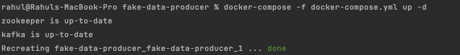
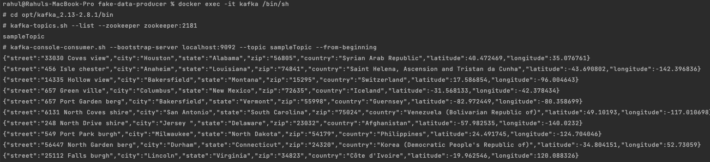

## fake-producer

### Introduction

An application which allows you to produce datasets and flush it to different queueing service like kafka, rabbitmq etc. 

#### dependencies
- [confluentic-kafka-go](https://github.com/confluentinc/confluent-kafka-go): kafka client to flush data to Kafka system
- [gofakeit](https://github.com/brianvoe/gofakeit): Random data generator written in go

### Prerequisite
- docker
- go
- kafka

### Usage

The application can be run with following ways:

with `PLAINTEXT` as security-protocol:

```shell
go run main.go kafka \
    --security-protocol PLAINTEXT \
    --bootstrap-server localhost:9092 \
    --topic sampleTopic \
    --nr-messages 0 \
    --max-waiting-time 0 \
    --model address
```

with `SSL` as security-protocol:

```shell
go run main.go kafka \
    --security-protocol SSL \
    --bootstrap-server localhost:9092 \
    --topic sampleTopic \
    --nr-messages 0 \
    --max-waiting-time 0 \
    --model address
```

where

- `security-protocol` : Security protocol for Kafka (PLAINTEXT, SSL, SASL_SSL)
- `bootstrap-server` : Kafka bootstrap server
- `topic` : Topic name
- `nr-messages` : Number of messages to produce (0 for unlimited)
- `max-waiting-time` : Max waiting time between messages (0 for none) in seconds
- `model` : data models to produce

#### Run application via docker

```shell
docker build -t fake-data-producer .

docker run fake-data-producer kafka \ 
    --security-protocol PLAINTEXT \
    --bootstrap-server localhost:9092 \
    --topic sampleTopic \
    --nr-messages 0 \
    --max-waiting-time 0 \
    --model address
```

via **[docker-compose](docker-compose.yml)**

It runs three services:
- zookeeper
- kafka
- fake-data-producer

```shell
docker-compose -f docker-compose.yml up -d
```



Let's check the data:

```shell
docker exec -it kafka /bin/sh
cd opt/<kafka version>/bin
kafka-topics.sh --list --zookeeper zookeeper:218
kafka-console-consumer.sh --bootstrap-server localhost:9092 --topic sampleTopic --from-beginning
```

